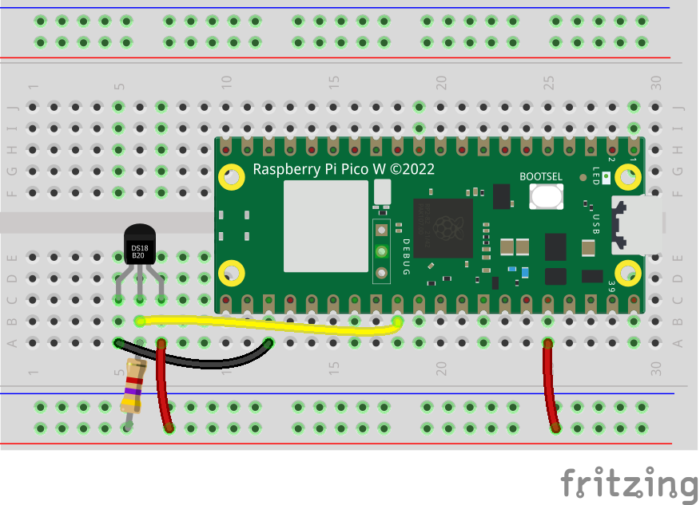

# Thermometer (DS18B20)

## Wiring

You'll need:

- A Pi Pico W-H
- A DS18B20 thermometer probe
- A 4.7k&#8486; resistor

:::note

You can substitute the 4.7k&#8486; resistor for most resistors of higher values, but they might not work.

:::



## Code

You don't need any external libraries - everything is preinstalled in MicroPython.

```py
import machine, onewire, ds18x20

ds_sensor = ds18x20.DS18X20(
    onewire.OneWire(
        machine.Pin(22)
    )
)
roms = ds_sensor.scan()
if len(roms) == 0:
    print("No thermometer found!")

def get_temp(unit: str="F") -> float:
    """
    Gets the temperature from the thermometer.

    Parameters:
    - unit: The unit of temperature to get the temperature in. Can be "F", "C", or "tuple". "tuple" causes a return value of (tempC, tempF).
    """
    global roms, ds_sensor
    ds_sensor.convert_temp()
    if unit not in ["F", "C", "tuple"]:
        raise ValueError(f"Invalid unit: {unit}")
    tempC = ds_sensor.read_temp(rom)
    tempF = temp * (9/5) + 32
    if unit == "tuple":
        return tempC, tempF
    elif unit == "C":
        return tempC
    elif unit == "F":
        return tempF

# ----- Example usage -----
# print(get_temp())
# > 75.0

# print(get_temp("C"))
# > 23.88889

# print(get_temp(unit="C"))
# > 23.88889

# print(get_temp("tuple"))
# > (23.88889, 75.0)
# print(get_temp("tuple")[1])
# > 75.0
```

## Further Reading

- https://randomnerdtutorials.com/raspberry-pi-pico-ds18b20-micropython/
