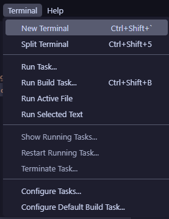

# Creating Project Structure

## Prerequisites

For this guide, you'll need:

- A computer with the tools from previous parts of this guide installed

## Creating a folder and initializing Git

- Open your file manager and find a location for your files. It doesn't matter where you place them - they can go anywhere you want.
- Create a folder in this location, and give it a name - it also can be whatever you want, but I recommend something along the lines of "AerospaceJam" or "AerospaceJam2024".
- Right click your new folder and select "Open with Code". If you're prompted about security, select "Yes, I trust the author".
- From the top context menus, select `Terminal > New terminal`.
  
  

- Now, a terminal will appear in the bottom of the screen. In this terminal, type the following command and press enter:
  
  ```sh
  git init
  ```

## Project structure options

There are many options for how you can structure your project, and there are no real "wrong" answers. You can choose to architect your project however you want - but, for ease of access for all teams, a template is provided at [this link](https://github.com/AerospaceJam/examples2024/blob/main/simple_webui). Feel free to extend the example code to your own project, write your own project from scratch, or even move beyond Python and write native C to run directly on the CPU. But I digress... Here's how you can get started with the example code:

- Download the samples repository from [here](https://github.com/AerospaceJam/examples2024/archive/refs/heads/main.zip) and unzip it somewhere.
- Copy the contents of the `simple_webui` folder to your project folder.
- Write some contents in the `README.md`, following [basic Markdown formatting](https://www.markdownguide.org/basic-syntax/) - for example:
  
  ```md
  # My Team's 2024-2025 Aerospace Jam Codebase

  This project is based on the simple WebUI example from the [Aerospace Jam Docs](https://aerospacejam.github.io/). It is capable of:

  - Sensor name 1
  - Sensor name 2
  ```

Now, we can transfer the code to the Pi and test it out!
