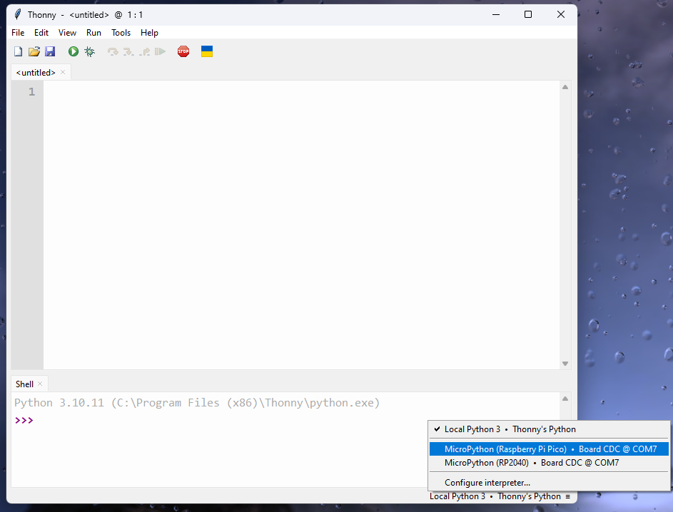
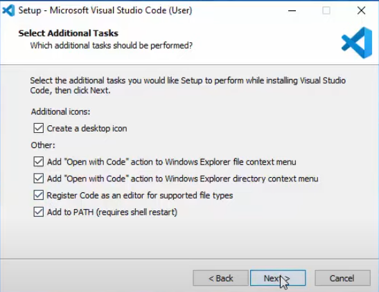

# Setting up IDEs and Git

## Prerequisites

For this guide, you'll need:

- A Micro-USB cable
- A computer with administrator rights (A school Chromebook won't work here)
- Your Raspberry Pi Pico W (which is included in your competition kit)

## Installing Thonny

:::note

This step and the rest of this guide assume that you are on Windows. If you're on MacOS, you should be able to get the correct versions of both of these apps from their sites. If you're on Linux, you should already know how to do this, and it's exceptionally likely that these packages are available on your preferred application distribution.

:::

- Download the Thonny installer from [here](https://github.com/thonny/thonny/releases/download/v4.1.4/thonny-4.1.4.exe) and run it.
- Select "Install for all users" and allow the action.
- Accept the license agreement and continue through the rest of the installer, leaving everything at its defaults. Once it completes, select "Finish".
- Make sure your Pi is connected to your computer via the USB cable.
- Open Thonny from your start menu, and accept the default settings.
- In the bottom right corner, select `Local Python 3 | Thonny's Python` and change it to `MicroPython (Raspberry Pi Pico)`.
  

## Installing Git

:::tip

If you're a `winget` user, you can run `winget install --id Git.Git -e --source winget` to skip these steps. If you don't know what `winget` is, keep reading.

:::

- Download the Git for Windows installer from [here](https://github.com/git-for-windows/git/releases/download/v2.46.0.windows.1/Git-2.46.0-64-bit.exe), and run it.
- Accept the license, and continue through (accepting the defaults) until you reach the default editor page - select Visual Studio Code from the dropdown.
- Continue onward until you reach "Adjusting your PATH environment" - select "Git from the command line and also 3rd-party software".
- Leave everything else at their defaults, and select "Install".
- After installation, uncheck "View release notes" and select "Finish".

## Installing Visual Studio Code

- Download the Visual Studio Code (hereafter referred to as "VSCode") installer from [here](https://code.visualstudio.com/sha/download?build=stable&os=win32-x64-user) and run it.
- Accept all the defaults up until the "Additional tasks" page - on this page, select all the options.
  
- After the installation completes, VSCode should launch.

Now, we're ready to begin setting up our project.